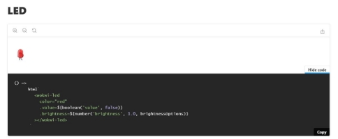
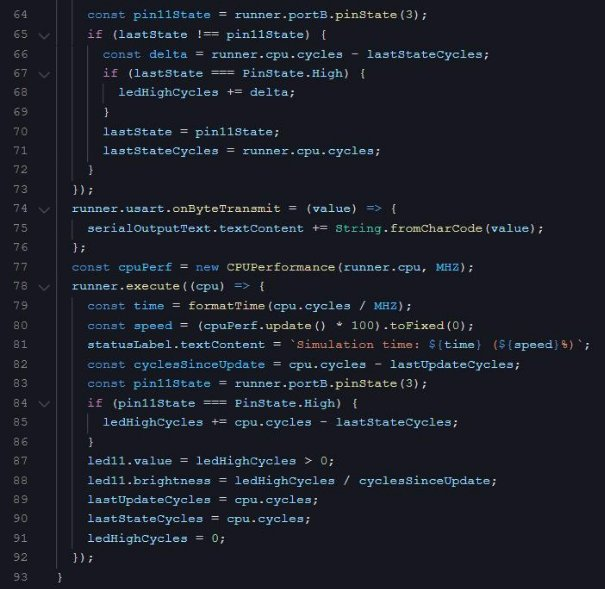

**Licence professionnelle Internet des Objets **

**Projet IOT** 

**Soutenance de stage**

Réalisé par : Omar Abouslime Année : 2020/2021 

**Abouslime     Licence Professionnelle Métiers des Réseaux Informatiques et Télécommunications : Internet des Objets Omar** 

**Année : 2020/2021** 

**REMERCIEMENTS** 

Je tiens à remercier Monsieur **Osmani**, Monsieur **Alim** et Monsieur **Massinissa HAMIDI** pour leur temps qu’ils ont consacré pour notre apprentissage lors de notre stage. 

**SOMMAIRE** 

Table des matières 

[REMERCIEMENTS .................................................................................................................................. 2 ](#_page2_x68.00_y111.92)[SOMMAIRE ............................................................................................................................................. 3 ](#_page3_x68.00_y142.92)[INTRODUCTION ..................................................................................................................................... 5 ](#_page5_x68.00_y89.92)

1. [Première semaine de stage : ....................................................................................................... 6 ](#_page6_x68.00_y89.92)

[Deuxième semaine de stage :.................................................................................................................. 7 ](#_page7_x68.00_y89.92)[Troisième semaine de stage : ................................................................................................................ 10 ](#_page10_x68.00_y89.92)[Missions de la troisième semaine : ................................................................................................... 10 ](#_page10_x68.00_y130.92)[Quatrième semaine de stage : .............................................................................................................. 12 ](#_page12_x68.00_y89.92)[Missions de la quatrième semaine : .................................................................................................. 12 ](#_page12_x68.00_y134.92)

2. [Cinquième semaine de stage : .................................................................................................. 15 ](#_page15_x68.00_y168.92)[Missions de la cinquième semaine de stage : ............................................................................... 15 ](#_page15_x68.00_y229.92)

[VI Semaine 6 à 8 : Série d’exercices ...................................................................................................... 18 ](#_page18_x68.00_y89.92)[Exercice 1  PushButton : .................................................................................................................... 18 ](#_page18_x68.00_y204.92)[Exercice](#_page19_x68.00_y727.92) [2](#_page19_x68.00_y727.92) [: ......................................................................................................................................... 19 ](#_page19_x68.00_y727.92)

[Exercice](#_page23_x68.00_y89.92) [3](#_page23_x68.00_y89.92) [: ......................................................................................................................................... 23 ](#_page23_x68.00_y89.92)

[Exercice](#_page24_x68.00_y111.92) [4](#_page24_x68.00_y111.92) [: ......................................................................................................................................... 24 ](#_page24_x68.00_y111.92)[VII Conclusion : ...................................................................................................................................... 26 ](#_page26_x68.00_y89.92)

**INTRODUCTION** 

Mon stage s’est déroulé au saint de l’université de Villetaneuse pour une durée de 8 semaines au total sous la supervision de M. **Osmani**, M. **Alim** et M. **Massinissa.** Avec une mise au point chaque semaine sur notre avancement dans le projet. 

Ce stage consister principalement a travaillé sur un projet de simulateur Arduino en binôme avec Thirou. 

**Un simulateur Arduino** est une application qui permet de tester plusieurs configurations de branchements grâce aux ressources de wokwi-elements. Cela évite d'une part qu’on ait à le construire sur maquette réelle, et d’autre part qu’on puisse comprendre comment certains composants se pilotent (pour voir si ceux-ci répondent à notre besoin). 

De cette façon, le simulateur Arduino simulera l'opération en vous donnant une bonne idée de ce qui se passerait dans la réalité. Alors, **avec Arduino IDE, Ardublock et Fritzing**, il peut être le complément parfait pour tous les créateurs qui aiment les projets de bricolage. 

1. Première semaine de stage : 

**La première semaine de stage consistait en :** 

-État de l'art, review des plateformes IoT existantes 

-installation plateforme, et résolution des problèmes lors de l’installation -Comprendre le fonctionnement des simulateurs d'architecture IoT en général -Identification de nos taches dans le projet 

**Partie 1 : plateforme et simulateur**  

**AWS IoT Core** : AWS IoT Core vous permet de connecter des périphériques IoT au Cloud AWS sans avoir à allouer ou gérer de serveurs. AWS IoT Core peut prendre en charge des milliards d'appareils et des trillions de messages. 

Il peut les traiter et les acheminer de manière fiable et sécurisée vers des points de terminaison AWS et d'autres appareils. Avec AWS IoT Core, vos applications peuvent communiquer avec tous vos appareils et assurer leur suivi à tout moment, même lorsqu'ils ne sont pas connectés. 

**Meilleures alternatives à AWS IoT Core** 

- Google Cloud IoT Core. 
- Datadog. 
- IBM Watson IoT Platform. 
- Cumulocity IoT. 
- Azure IoT Hub. 
- SensorCloud. 
- ThingSpeak. 
- Ayla IoT Platform. 
2. Deuxième semaine de stage : 

**La deuxième semaine de stage consisté :** 

-installation de node JS 

-familiarisassions avec Github, installer Gitbash pour pouvoir stocker et partager nos codes  -installation de npm 

-simulation carte arduino avec les exemples fournis 

La première étape a était d’installer node JS pour pouvoir utiliser npm (exécuter  les commandes npm start/ npm run) 

[https://nodejs.org/en/download/ ](https://nodejs.org/en/download/)

**Créer 1 dossier clone pour tawjaw et ouvrir git bash dessus :**

git init

git clone[ https://github.com/tawjaw/Arduino-Robot-Virtual-Lab.git](https://github.com/tawjaw/Arduino-Robot-Virtual-Lab.git)

**créer 1 dossier clone pour wokwi-elements et ouvrir git bash dessus :** git init

git clone https://github.com/wokwi/wokwi-elements.git

On peut le voir sur l’image ci-dessous on a créé un nouveau dépôt sur Github pour pouvoir modifier stocker et partager nos codes avec Omar et les différents professeurs. 

Enfin avec les les commande npn install et start on va **accéder host servers : tawjaw - localhost:1234** 

**wokwi - localhost:6006** 

Ici on a accédé au projet tawjaw en l’hébergeant en localhost pour essayer les différents exemples de simulation déjà existants. 

Ici nous avons accès aux différent éléments **wokwi** en localhost que l’on va pouvoir utiliser dans les prochaines séances lors des simulations  

3. Troisième semaine de stage : 

Missions de la troisième semaine : 

- réappropriation et compréhension du code  
- intégration led et pushbutton 
- binding des id et des instances  

Dans cette troisième semaine nous avons réussi à intégrer une carte Arduino, une LED et un bouton poussoir. 

On a travaillé sur des fichiers .hbs pour le côté « front-end » et sur des fichiers .ts pour le côté « back- end ». 

Grâce à notre instance **wokwi-elements**, nous avons accès à une large gamme de composants et surtout à leur **doc**. Celle-ci nous a permis d’avoir le code qui nous permets d’intégrer les différents wokwi-elements à nos pages .hbs. 

Notre première mission était d’implémenter un push button et une LED. 

En jetant un coup d’œil au code, j’ai remarqué que les wokwi-elements étaient contenus dans le dossier node\_modules. 

Nous avons donc rajouté les import des éléments LEDElement et PushButtonElement via wokwi-elements. 

En essayant d’ajouter notre instance led à l’unoBoard via la méthode unoBoard.addConncection (voir image ci-dessus) nous nous sommes rendu compte qu’il y avait une erreur au niveau de notre instance. Nous verrons par la suite ce qui n’allait pas. 

4. Quatrième semaine de stage : 

Missions de la quatrième semaine : 

- Plusieurs essais pour setup les pins de LED et d'Arduino non concluants. 
- Découverte de la classe LitElement, compréhension de son fonctionnement et recherche de l'emplacement des pins 
- Compréhension des fichiers sources, p4, node\_elements -problème affichage  

Découverte que LEDElement hérite de LitElement. 

Classe ArduinoUno (unoBoard hérite de celle-ci), on voit qu’au niveau de la méthode addConnection, l’instance component est de type Component. LEDElement hérite de LitElement donc cela nous pose problème. 

**Classe Component 1** 

LED Element et PushButtonElement héritent tout deux de la classe LitElement. 

De plus la LED ne s’affichait plus, ce qui nous faisait un problème de plus à résoudre. Cette semaine était remplie de recherche pour comprendre comment résoudre ce problème de type de classe. 

5. Cinquième semaine de stage : 

Missions de la cinquième semaine de stage : 

- création de la classe LedComponent 
- réussite de la simulation 

Nous avons finalement compris comment faire :  

On commence par créer une instance LEDElement en lui attribuant l’id #led1 (pour pouvoir la récupérer dans le fichier .hbs). 

Nous avons compris, grâce à la classe ArduinoUno et à sa méthode setUnoElement, qu’un Component doit posséder son Element (héritant donc de LitElement). 

Nous avons donc créé notre propre classe LEDComponent héritant de Component, possédant en attribut son ledElement étant de type LEDElement (celle-ci héritant donc de LitElement).

Et magie, la LED s’allume enfin.  

6. Semaine 6 à 8 : Série d’exercices  

Dans cette partie du stage, nous avons eu pour mission une série d'exercice au nombre de 5.  Malgré le fais nous ayons eu beaucoup d'erreurs nous avons essayé de compléter au mieux ces exercices. Nous allons détailler plus précisément les enjeux de ces exercices et les difficultés rencontrées.  

Exercice 1 PushButton :  

Maquette du localhost :  

Fichier .ts :  

Ici, on créer une classe PushButtonComponent héritant donc de Component (pour pouvoir l’ajouter au unoBoard comme expliqué précédemment). 

On ajoute un listener qui envoie « true » en cas de button-press et « false » en cas de button-release. Tout s’est bien passé. 

Exercice 2 Potentiometer :  

L’exercice constait en un potentiometer qui réglait la brightness d’une LED. 

Fichier ts :  

Ici aussi on s’aide d’un listener de la même façon que la classe précédente. 

Cependant le problème c’est que la classe unoBoard n’offre pas de méthode pour écrire une valeur numérique dans ses pins. J’ai dû la rajouter (writeAnalogPin) : 

(Fichier ArduinoUno.d.ts) 

(Fichier ArduinoUno.js) 

Le problème est que lorsque que cette méthode est appelée, la méthode n’es pas reconnue du tout… Cette erreur est vraiment curieuse nous n’avons pas réussis à comprendre d’où elle venait malgré tous nos tests (voir ci-dessous). 

Logs de la console durant les appels de la fonction writeAnalogPin. 

Exercice 3 Buzzer : 

Cet exercice consistait à faire fonctionner un buzzer. Voici la maquette :  

Ici le souci est que l’attribut buzzerElement.hasSignal ne change pas. 

Console logs 

Exercice 4 Fading a LED : 

L’exercice 4 consistait à modifier la brightness d’une LED. 

Pour cet exercice je me suis beaucoup appuyer sur le projet déjà fais ci-après : [https://stackblitz.com/edit/avr8js-pwm?file=index.ts ](https://stackblitz.com/edit/avr8js-pwm?file=index.ts)

Cette partie du code permet l’effet « fading » de la LED. Mais comme vous avez pu le voir ici on n’utilise pas des classes que l’on crée, le développeur joue directement sur avr8js (l’outil de simulation d’Arduino en JS). Je n’ai pas réussi à exporter cette méthode de travail à la mienne (méthode de travail à partir de classes) … 

**Conclusion :** 

`  `Ce stage m’a beaucoup appris, il m’a permis de renforcer mes compétences en Javascript et de reprendre la main avec l’outil Git. Il m’a aussi appris à « manager » une équipe car mon binôme Thirou n’avait jamais fais de Javascript avant ce stage. 

`  `Malheureusement le Javascript n’étant pas notre spécialité et pas approfondie cette année scolaire, nous avons eu beaucoup de mal à la dernière partie de ce stage (la phase un peu plus difficile). Beaucoup de problèmes se sont enchainés et nous avions eu du mal à tenir le rythme. 

`  `Malgré cette frustration à la fin, ce stage reste néanmoins une très bonne expérience et nous a d’ailleurs permis de comprendre comment peut fonctionner Arduino sous un nouvel angle (AVR8JS, AVR Runner). 
PAGE25 
